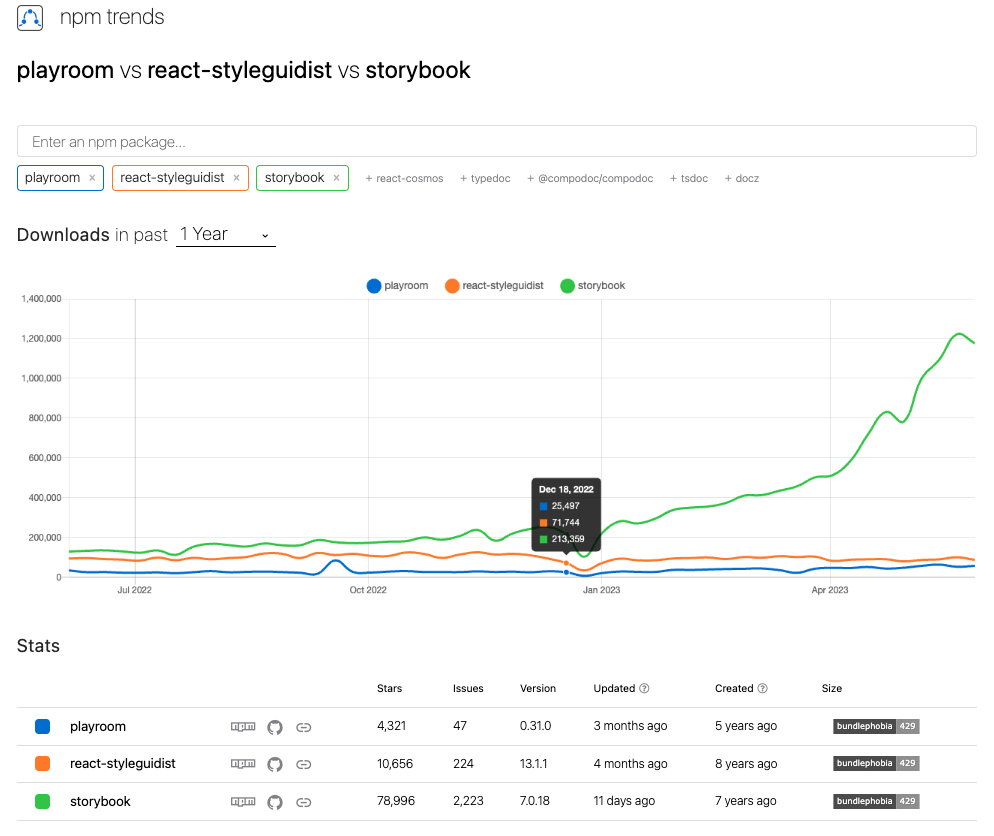

# What is Storybook?

Storybook is a frontend workshop for building UI components and pages in isolation. Thousands of teams use it for UI development, testing, and documentation. It’s open source and free

# Why Storybook?

So many requirement, like

- Responsiveness
- Browsers
- Accessibility
- Performance
- All variations needed to fit all use cases and a place to organize

# Quick Facts:

- Airbnb, IBM, and Dropbox use it
- Compatible with React, Vue, and Angular
- Usage: 500,000 devs
- 60,000 stars on github
- Integrates with Jest, React Testing Lib, And Cypress
- 1.3 Million weekly downloads, compared to 200,000 for playwright, and 50,000 for bit

# The main competitors to Storybook include:

1. Styleguidist: This tool emphasizes showcasing components with their respective code examples and props. However, it doesn't offer the same level of interactivity and isolated development environment as Storybook.
2. Playroom: Playroom allows you to simultaneously design across a variety of themes and screen sizes, with the code generated in real-time. Still, it lacks the robustness and feature-rich environment that Storybook provides.
3. Bit: Bit emphasizes component sharing and collaboration. It's useful if you have many shared components across multiple projects. However, it does not provide the same level of documentation or testing utilities that Storybook offers.

# NPM trends



# Getting Started with StoryBook

To install:

```js
npx sb init
```

First delete the whole stories dirctory, then you'll want to create a new file in the stories directory.
Let's call it FunButton.stories.js. The code might look something like this:

```js
import React from "react";
import FunButton from "./FunButton";

// This default export determines where your story goes in the story list
// The title corresponds to the path you'll see in the Storybook UI (eg: "FunButton")
// The component is a reference to the component for which we're writing stories
export default {
  title: "FunButton",
  component: FunButton,
};

// Template is a function that returns a FunButton component with a set of props
// This template will be reused across stories to maintain consistency
const Template = (args) => <FunButton {...args} />;

// Default is a standard FunButton
export const Default = Template.bind({});
// args are the "arguments" (props) that get passed to the FunButton in the Default story
Default.args = {
  children: "Button Text",
  size: "medium",
  variation: "default",
  theme: "light",
};

// SmallOutlined is a small, outlined FunButton
export const SmallOutlined = Template.bind({});
// Different args (props) are passed in to show a different variant of the FunButton
SmallOutlined.args = {
  children: "Button Text",
  size: "small",
  variation: "outline",
  theme: "light",
};

// LargeGhost is a large FunButton with the "ghost" variation
export const LargeGhost = Template.bind({});
// Again, different args show a different variant
LargeGhost.args = {
  children: "Button Text",
  size: "large",
  variation: "ghost",
  theme: "light",
};
```

To add on Documentation for your component just add this,

```js
export default {
  title: "FunButton",
  component: FunButton,
  tags: ["autodocs"], // <-- Add this line here>
};
```

<!-- // bug below is not needed update to use autoDocs: tag -->

# Things not covered but may want to look further into:

- [Visual Testing](https://storybook.js.org/docs/react/writing-tests/visual-testing)
- [Test Coverage](https://storybook.js.org/docs/react/writing-tests/test-coverage)
- [Snapshot tests](https://storybook.js.org/docs/react/writing-tests/snapshot-testing)
- [Integrations with Jest, RTL, and Cypress](https://storybook.js.org/docs/react/writing-tests/snapshot-testing)

## Useful Links:

- [Storybook Official Docs](https://storybook.js.org/)
- [Essential Addons](https://storybook.js.org/docs/react/essentials/introduction)

<!-- // bug mention chatGPT strengths and weaknesses -->
